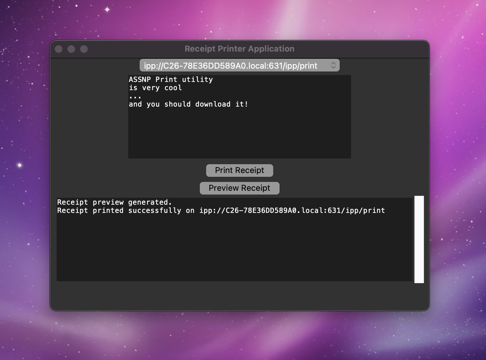

# ASSNP Print Utility

The ASSNP Print Utility is a Python script that allows you to print custom receipts and labels using the Amazon Smart Sticky Note Printer (ASSNP). This script provides a user-friendly interface for entering receipt details, previewing the receipt, and sending it to the printer.



## Background

The Amazon Smart Sticky Note Printer is a unique device that uses standard receipt paper but was designed to work exclusively with Alexa. However, with some reverse engineering and experimentation, it is possible to control the printer directly using Python scripts and the IPP (Internet Printing Protocol) interface.

This script builds upon the findings and experiments documented in the [technical report](https://www.markury.dev/posts/stickynote-printer) by [me](https://github.com/Markuryy). The original idea and initial insights were shared on [Hacker News](https://news.ycombinator.com/item?id=34031060).

## Features

- Discover available printers on the network using the `ippfind` command
- Enter custom receipt details using a text input field
- Preview the receipt before printing
- Print the receipt on the selected ASSNP device
- Console for displaying log messages and status updates

## Requirements

- Python 3.x
- PIL (Python Imaging Library)
- ImageMagick (for image conversion)
- `ippfind` command-line tool (part of CUPS)
- `ipptool` command-line tool (part of CUPS)

## Usage

1. Make sure you have the required dependencies installed.
2. Connect the ASSNP to your network and ensure it is properly set up.
3. Run the script using Python:

   ```
   python main.py
   ```

4. Select the desired printer from the dropdown menu.
5. Enter the receipt details in the text input field, with each line representing a separate item.
6. Click the "Preview Receipt" button to view a preview of the receipt.
7. Click the "Print Receipt" button to send the receipt to the selected printer.

## Limitations and Workarounds

The ASSNP has several limitations and quirks that required workarounds to achieve successful printing:

- The printer reports supporting the "image/pwg-raster" format, but this is not actually supported. Instead, it supports a unique format called "image/reverse-encoding-bmp", which is a vertically flipped BMP image.
- The image must be exactly 576 pixels wide to fit the receipt paper.
- The maximum printable height is limited, requiring the receipt to be divided into smaller chunks for printing.
- The printer may not automatically cut the paper after printing, so a "thank you" message is added at the bottom of the receipt to ensure proper cutting.
- The script is currently compatible only with macOS, as it relies on the `ippfind` and `ipptool` commands provided by CUPS.

## Customization

You can customize the receipt layout and styling by modifying the `create_receipt_image` function in the script. Adjust the logo size, font sizes, line spacing, and positioning to suit your preferences.

Replace the `logo.png` file with your own logo image. Ensure that the image is in PNG format and has a transparent background for best results.

## Troubleshooting

If you encounter any issues while using the ASSNP Print Utility, consider the following:

- Verify that the printer is properly connected to the network and powered on.
- Ensure that you have the necessary dependencies installed, including Python libraries and command-line tools.
- Check the console for any error messages or status updates that may provide insights into the problem.
- Make sure the logo image file (`logo.png`) exists in the same directory as the script.

## Contributing

Contributions to the ASSNP Print Utility are welcome! If you have any ideas, improvements, or bug fixes, please submit a pull request on the [GitHub repository](https://github.com/Markuryy/ASSNP-Print-Utility).

## License

This script is released under the [MIT License](https://opensource.org/licenses/MIT).

## Acknowledgments

Special thanks to the contributors and commenters on the [Hacker News post](https://news.ycombinator.com/item?id=34031060) for their insights and suggestions.

---

Made with ❤️ by [Markury](https://github.com/Markuryy)
